# Agent Tokenwatch v0.2.0 Architecture - Privacy-Allowlisted Multi-Agent Telemetry Pipeline

## Overview

Agent Tokenwatch is a dependency-free Node.js CLI that captures local, metadata-only token and cost telemetry from Claude Code, OpenAI Codex CLI, and GitHub Copilot CLI by normalizing each agent's hook/status/OTLP payloads through per-agent adapters into one privacy-allowlisted event schema before anything touches disk. It features append-only JSONL storage with a compact reducible state file, a loopback OTLP receiver for Codex, a reversible hook/status-line installer that can keep another tool's status line running beside its own, and a shared bundle of seven `/tw-*` Claude Code Skills - a concept primer, a status-line explainer, two backward-looking retrospectives, an interactive coach, a forward-looking experiment-defining audit, and a history importer that repairs its own mappings - that turn the local data into evidence-based cost recommendations.

## Core Architecture

```mermaid
graph TB
    subgraph "Coding agent CLIs (hook / stdin / notify sources)"
        CLAUDE["Claude Code<br/>• Lifecycle hooks (JSON on stdin)<br/>• statusLine command (JSON on stdin)<br/>• /tw-* Skill invocation (seven bundled skills)"]
        CODEX["OpenAI Codex CLI<br/>• notify turn-complete (JSON argument)<br/>• OTLP/HTTP export (JSON or protobuf)"]
        COPILOT["GitHub Copilot CLI<br/>• JSON hook config file<br/>• statusLine.command (JSON on stdin)"]
    end

    subgraph "Tokenwatch CLI (bin/tokenwatch.mjs, Node.js 20+, zero runtime deps)"
        DISPATCH["Command dispatcher<br/>src/cli.mjs<br/>• hook / status / analyze / export<br/>• experiment / repair / prune<br/>• agents / doctor / config<br/>• install / uninstall / paths<br/>• otlp serve / notify-relay / codex<br/>• import (history: typed, or run by tw-import-history)<br/>• status --compose: up to MAX_COMPOSE_COMMANDS bounded children per render"]
        NORM["Agent adapters<br/>src/normalize/*.mjs<br/>• per-agent field-alias extraction<br/>• builds canonical usage/cost"]
        SCHEMA["Event schema<br/>src/schema.mjs + privacy.mjs<br/>• makeEvent() allowlist builder<br/>• assertPrivacySafe() forbidden-key guard"]
        OTLPRX["OTLP receiver (loopback :4318)<br/>src/otlp-server.mjs + otlp-protobuf.mjs<br/>• /v1/logs, /v1/metrics<br/>• bounded hand-rolled protobuf decoder"]
        STORE["Store and state reducer<br/>src/store.mjs<br/>• fingerprint dedupe<br/>• cumulative-cost delta<br/>• cache-TTL bookkeeping"]
        AGG["Aggregator<br/>src/aggregate.mjs + format.mjs<br/>• turn grouping<br/>• rolling status snapshot"]
        ANALYZE["Audit engine<br/>src/analyze.mjs<br/>• evidence + labeled recommendations"]
        RANK["Cost-driver ranking<br/>src/rank.mjs<br/>• shares, concentration, period comparison<br/>• falls back to billing-unit ranking (e.g. AIU) when no USD exists"]
        JOURNAL["Experiment journal<br/>src/experiments.mjs<br/>• append-only JSONL, open/close"]
        INSTALLER["Installer<br/>src/installer.mjs<br/>• reversible hook/status-line writes<br/>• per-scope install-state records<br/>• composes a taken status line by default, --repair re-composes<br/>• composedStatusCommand(): the gate on what a render runs"]
        IMPORT["History import (typed, or run by tw-import-history)<br/>src/import/*.mjs<br/>• closed per-agent mappings, bounded line reader<br/>• overlap check against live capture before writing<br/>• idempotent, run record, exact undo"]
        HOST["Host-agent detection<br/>src/host.mjs<br/>• detectHostAgent() via env markers<br/>• agentActivity() per-agent ledger summary"]
    end

    subgraph "Local data (~/.tokenwatch, file mode 0600 where the platform supports POSIX modes; on Windows the files inherit the profile ACL instead)"
        EVENTS[("events.jsonl<br/>• append-only<br/>• one tokenwatch.event/v1 record per line")]
        STATE[("sessions/s_&lt;hash&gt;.json<br/>• recent per-agent summaries<br/>• cumulative-cost/usage/billing baselines<br/>• cache activity timestamps<br/>• one file per agent session (falls back to state.json when no session id)<br/>• rewritten under s_&lt;hash&gt;.lock, one process at a time")]
        EXP[("experiments.jsonl<br/>• append-only<br/>• proposed change + baseline + metric<br/>• close records with measured outcome")]
        CFG[("config.json / install-state.json<br/>• local settings<br/>• restorable install records<br/>• composed status command + shell + sha256<br/>• backups/skills: skill text --force replaced, mode 0600")]
        IMPORTS[("imports.json<br/>• one record per import run: counts, ids, dates<br/>• planned before the rows, measured after")]
        RELAY[("codex-relay.json<br/>• Codex notify relay's last recorded turn<br/>• its last 20 failures: stage + error class, no payload")]
    end

    SESSIONFILES["Agents' own session files<br/>~/.claude/projects, ~/.codex/sessions, ~/.copilot/session-state<br/>• hold prompts and code: opened only by tokenwatch import"]

    OTHERSL["Other tools' status lines (up to 4)<br/>• adopted by a default install or --repair<br/>• replayed through the agent's own shell<br/>• same stdin bytes, TOKENWATCH_COMPOSED=1<br/>• killed at status.composeTimeoutMs, 64 KiB output cap"]

    SKILL["Bundled skills<br/>skills/*/SKILL.md<br/>• tw-cost-drivers-basics, tw-explain-statusline<br/>• tw-retrospective-this-session, tw-retrospective-overall<br/>• tw-token-cost-coach, tw-cost-audit-define-experiment<br/>• tw-import-history (runs tokenwatch import after the user's yes)<br/>• installed into .claude/skills, .agents/skills<br/>• call tokenwatch analyze --group-by / experiment"]

    CLAUDE -->|hook JSON stdin| DISPATCH
    CLAUDE -->|statusLine JSON stdin| DISPATCH
    COPILOT -->|hook JSON stdin| DISPATCH
    CODEX -->|notify JSON arg| DISPATCH
    DISPATCH -.->|relay outcome| RELAY
    CODEX -.->|OTLP/HTTP JSON or protobuf| OTLPRX

    DISPATCH --> NORM
    OTLPRX --> NORM
    NORM --> SCHEMA
    SCHEMA --> STORE
    STORE --> EVENTS
    STORE --> STATE

    STATE --> AGG
    AGG -->|status line text| DISPATCH
    DISPATCH -->|rendered status| CLAUDE
    DISPATCH -->|rendered status| COPILOT
    DISPATCH -.->|--compose: replay recorded commands| OTHERSL
    OTHERSL -.->|its rows, printed beside Tokenwatch's| DISPATCH

    EVENTS --> ANALYZE
    EVENTS --> RANK
    ANALYZE -->|markdown/json audit| DISPATCH
    RANK -->|ranked shares, concentration, comparison| DISPATCH
    DISPATCH <-->|experiment add / list / close| JOURNAL
    JOURNAL --> EXP
    EVENTS --> HOST
    DISPATCH <-->|tokenwatch agents| HOST
    DISPATCH -->|tokenwatch analyze --json| SKILL
    SKILL -->|tokenwatch agents, then analyze/status/doctor --json| DISPATCH
    SKILL -->|/tw-*| CLAUDE
    DISPATCH -->|tokenwatch import| IMPORT
    SESSIONFILES -.->|numbers and ids only| IMPORT
    EVENTS -->|live rows for the overlap check| IMPORT
    IMPORT -->|makeEvent rows, appendImportedEvents| EVENTS
    IMPORT --> IMPORTS

    INSTALLER -.->|reads/writes| CFG
    INSTALLER -.->|manages hooks + statusLine| CLAUDE
    INSTALLER -.->|manages hooks + statusLine| COPILOT
    INSTALLER -.->|manages notify + otel block| CODEX
    INSTALLER -.->|installs| SKILL

    style CLAUDE fill:#F3E5F5,color:#4A148C
    style CODEX fill:#F3E5F5,color:#4A148C
    style COPILOT fill:#F3E5F5,color:#4A148C
    style OTHERSL fill:#F3E5F5,color:#4A148C
    style DISPATCH fill:#E8F5E8,color:#1B5E20
    style NORM fill:#E8F5E8,color:#1B5E20
    style SCHEMA fill:#E8F5E8,color:#1B5E20
    style OTLPRX fill:#E8F5E8,color:#1B5E20
    style STORE fill:#E8F5E8,color:#1B5E20
    style AGG fill:#E8F5E8,color:#1B5E20
    style ANALYZE fill:#E8F5E8,color:#1B5E20
    style HOST fill:#E8F5E8,color:#1B5E20
    style INSTALLER fill:#F5F5F5,color:#000000
    style EVENTS fill:#FFF3E0,color:#E65100
    style STATE fill:#FFF3E0,color:#E65100
    style CFG fill:#FFF3E0,color:#E65100
    style RELAY fill:#FFF3E0,color:#E65100
    style SKILL fill:#E3F2FD,color:#0D47A1
```



## Key Components

### 1. Command dispatcher

**What it does:**
- Single entry point that routes CLI subcommands to handlers
- Loads/creates `config.json` before dispatching (a `doctor` probe is answered before that, so it writes nothing); `tokenwatch doctor` itself loads it with `create: false`, using the defaults in memory when there is no file, so doctor never creates `config.json`, its random `projectSalt`, or the data directory
- Reads hook JSON from stdin, a positional argument, or `--payload`; the status line reads stdin only
- A `status` run by hand, with no payload, resolves its session from `--session <id>` or the agent's own verified session variable (`hostSessionId`), else the most recent session, and reports which in `session_scope` on `--json` output and a `note:` under a fallback
- Fails open on hook errors unless `--strict` is passed
- Under `status --ingest-stdin --compose <install-key>` (`handleStatus`, `runComposedCommands`), reads stdin once as raw bytes, starts every other status command the install record allows (up to `MAX_COMPOSE_COMMANDS`, 4) at once with those bytes on their stdin, records Tokenwatch's own reading while they run, then prints their outputs as one block in record order and Tokenwatch's rows before or after it, as configured

**Technology stack:**
- Plain ESM JavaScript, Node.js built-ins only (`node:fs`, `node:child_process`)

**Key files/modules:**
- `bin/tokenwatch.mjs` - process entry point, top-level error printer
- `src/cli.mjs` - `main()` command switch and per-command handlers
- `src/args.mjs` - minimal `--flag value` / `--no-flag` argv parser
- `src/help.mjs` - static help text

**Integration points:**
- Invoked directly by users (`tokenwatch analyze ...`)
- Invoked by installed agent hooks/status-line commands with absolute, quoted paths to the current Node executable and this file (on Windows, Claude Code's commands start the `node` on `PATH` instead, so Git Bash and PowerShell both run them)

**Real challenges:**
- Hook commands must never throw back into the coding agent; `handleHook` swallows every error unless `--strict` is explicitly requested
- Status-line ingestion has to work whether or not the process is a TTY, since agents pipe JSON on stdin non-interactively
- A composed render is the one status path that starts other processes, and the status line must still render whatever they do. `runComposedCommands` resolves with one outcome per command in every case (`ok`, `exit-nonzero`, `timeout`, `spawn-failed`), keeps at most `MAX_COMPOSE_OUTPUT_BYTES` (64 KiB) of each one's stdout, and owns every child with one signal handler and one timer: on `status.composeTimeoutMs` or a `SIGTERM`/`SIGINT`/`SIGHUP` to Tokenwatch it stops every child with everything it started at once (`killProcessTrees()`, `src/spawn.mjs`: off Windows each child is spawned detached, leading its own group, which gets `SIGKILL`; Windows has no such group, so one `taskkill /T /F` from the system folder, bounded at 2 s, walks every tree by parent id while the shells are still alive, where killing the shell alone had left the program it started holding the pipes and the render open until it finished, and the shells then go through Node's handle), then lets go of every unfinished child's pipes, because Claude Code cancels an in-flight status script when the next update arrives and a cancelled render must not leave any other command running. A per-child handler would have exited after killing only its own child. A timed-out child's output is discarded; the others and Tokenwatch's rows still print
- A child is killed by its process id only while Node has not seen it exit (`exitCode` and `signalCode` both null): until then the id is still its own (off Windows an unreaped zombie holds it; on Windows Node's open process handle stops the id being reused). A shell that exits while a program it started still holds the pipe leaves an id Windows may hand to an unrelated program at once, and `taskkill /T /F` on it would take that program's whole tree, so such a shell is not killed; its pipes are only let go, and the program it left is not stopped (nothing safe identifies it) but runs until it ends or its next write to the released pipe fails. While a shell is alive, `taskkill /T` can still reach a process that recorded the shell's id as its parent's before the shell existed; that is inherent to how Windows tree kills work
- Composition is skipped, silently on the status bar and with a reason under `TOKENWATCH_DEBUG=1`, for `--json` output, for an agent without a command-backed status line, for an empty stdin, and inside a render that is itself composed (`TOKENWATCH_COMPOSED=1`, which the child inherits), so a `tokenwatch status` inside the other command never composes again

### 2. Agent adapters (normalizers)

**What it does:**
- Translate each agent's raw hook/status/notify/OTLP payload into the shared canonical usage/cost shape
- Extract identifiers (session, turn, model, project) using ordered lists of known field-name aliases, tolerating snake_case/camelCase drift
- Compute structural metrics (byte lengths of prompts/tool I/O, file counts) instead of retaining the content itself

**Technology stack:**
- Plain ESM modules, no schema library; alias-list lookups (`firstValue`/`firstNumber`/`firstString`) shared across adapters

**Key files/modules:**
- `src/normalize/index.mjs` - dispatches by agent name (`claude`, `codex`, `copilot`) and by OTLP path (`/v1/logs` vs `/v1/metrics`)
- `src/normalize/claude.mjs` - Claude Code hook/status adapter; distinguishes `components` cache semantics (fresh vs. 5m/1h cache-write tokens reported separately)
- `src/normalize/codex.mjs` - Codex `notify` adapter plus the OTLP logs/metrics adapters (`cached_subset` semantics, where cached tokens are a subset of total input)
- `src/normalize/copilot.mjs` - Copilot CLI hook/status adapter (`cached_subset` semantics)
- `src/normalize/common.mjs` - shared alias lookup, HMAC project identity, context-window extraction, fingerprint construction, `canonicalUsage()`

**Integration points:**
- Consumes raw payloads from the dispatcher (hook/status/notify) and from the OTLP receiver
- Produces one or more draft events consumed by the event schema builder

**Real challenges:**
- Claude, Codex, and Copilot CLI field names are not contractually stable; every adapter tries several historical/likely field spellings per value rather than one exact key
- Two incompatible cache-accounting conventions (components vs. cached-subset) must be reconciled without double- or under-counting input tokens
- Codex's OTLP log records fill `logRecord.eventName` with a Rust source location (e.g. `event otel/src/events/session_telemetry.rs:570`) rather than a semantic name; `normalizeLogRecord` reads the `event.name` attribute (falling back to `event_name`/`name`/`codex.event.name`/`gen_ai.operation.name`, then the record's own `eventName` field last) or every event looks like a distinct source line instead of a recognizable event
- Codex sends `timeUnixNano: 0` on some records and puts the real instant in `observedTimeUnixNano` or a reported `event.timestamp` attribute instead; `nanosToIso()` skips zero/empty candidates so a naive `??` chain does not silently date every OTLP event to 1970 and hide it from `--since` filtering
- Copilot's input total already contains both cache halves, so its adapter derives `input_fresh` as `input_total - cache_read - cache_write` (`copilot.mjs`), which differs from the plain `cached_subset` subtraction (`input_total - cache_read`) the shared rule in `common.mjs`/`schema.mjs` uses for providers that report no cache-write count

### 3. Event schema and privacy guard

**What it does:**
- Builds the canonical `tokenwatch.event/v1` record from adapter output, allowlisting only known fields at fixed size limits
- Derives missing usage fields (`input_fresh`/`input_total`/`total`) deterministically per usage semantics
- Cleans and allowlists two parallel, non-currency fields for providers that bill in units rather than dollars: `billing` (a per-call delta) and `billing_cumulative` (the provider's running total), each a `{unitName: amount}` map (`cleanBillingUnits()`), kept structurally apart from `cost` so nothing can add units to dollars
- Runs a second, independent forbidden-key scan (`assertPrivacySafe`) as defense in depth before and after storage-layer mutation

**Technology stack:**
- Plain ESM, `node:crypto` for identifiers, no schema validation library

**Key files/modules:**
- `src/schema.mjs` - `makeEvent()`, `cleanUsage()`, `cleanCounters()`, `cleanBillingUnits()`, `cleanCost()` (private to the module), `assertPrivacySafe()`
- `src/privacy.mjs` - `hmacIdentity()` (salted project hashing), `safeString()`/`safeIdentifier()` (control-character stripping and truncation), `finiteNonNegative()`

**Integration points:**
- Called by every adapter (`makeEvent`) and by the store (`assertPrivacySafe`)
- Enforces a hard per-event byte-size ceiling, throwing rather than persisting an oversized record

**Real challenges:**
- The allowlist has to be maintained by hand as new fields are added; a forgotten allowlist entry silently drops data instead of leaking it, which is the intended fail-safe direction
- `assertPrivacySafe` intentionally duplicates protection already provided by the allowlist builder, in case a future code path constructs an event by another route

### 4. Store and state reducer

**What it does:**
- Deduplicates retried telemetry using a rolling window of recent fingerprints
- Converts a provider's cumulative session cost into a per-event delta using the previous cumulative value for the same agent/session (`applyCumulativeCost`)
- Applies the same cumulative-to-delta diffing to token counters (`applyCumulativeUsage`, for Copilot's session-cumulative usage) and to non-currency billing counters (`applyCumulativeBilling`, for Copilot's AI units/premium requests), so all three additive quantities are derived the same way
- Applies an optional local pricing estimate only when no provider-reported cost is present
- Tracks cache activity timestamps per agent/session/model for "cache warm" status reporting
- Buffers per-turn subagent windows (`trackSubagentWindow`) to report cost/units accrued while at least one subagent was active
- Keeps a running total of each reply a prompt hook opens (`replyTotals`: calls, billing units and cost, for the newest 50 replies; a reply mixing provider figures and estimates is marked `mixed`), which the status line's `this reply` and `previous reply` read
- Appends the finished event to `events.jsonl` and atomically rewrites the per-session state file (or `state.json` as a fallback for events with no session id), the read, the reduction, the append and the rewrite all under that file's lock (`withStateLock`, `src/state-lock.mjs`)

**Technology stack:**
- Plain ESM, `node:fs` streaming/atomic writes, `node:readline` for line-oriented reads

**Key files/modules:**
- `src/store.mjs` - `storeEvent()`/`storeEvents()`, `readEvents()`/`collectEvents()`, `pruneEvents()`, `statusState()`, `sessionStateFile()`/`loadState()`/`loadSessionState()` (per-session state file resolution; `loadSessionState` also says whether any tier held the session), `mostRecentSession()`, `resolveStatusSession()` (which session a hand-run `status` reports, whether it is a fallback, and the state read for it)
- `src/fs-util.mjs` - `atomicWriteJson()`/`writeTextAtomic()` (write-to-temp-then-rename), `ensureDir()`, `readJson()`
- `src/state-lock.mjs` - `withStateLock()`/`acquireStateLock()`/`releaseStateLock()`, `stateLockFile()`, `STATE_LOCK_BUDGET_MS`/`STATUS_LOCK_BUDGET_MS`/`STATE_LOCK_STALE_MS`: the per-session lock every rewrite of a state file holds (`storeEvent()`, `tryFlushPendingTurns()`, `repairLedger()`)
- `src/store.mjs` also holds the ledger's second writer, `appendImportedEvents()` (imported rows only: every row passes `assertImportedRows()` - the source check and `assertPrivacySafe` - before the file opens, and the import runs the same guard before it records its plan; it touches no session state, and a failure part-way throws with the count of whole rows appended), and the pure `diffCumulativeUsage()` the live reducer and the import share for running totals

**Integration points:**
- Receives finished events from the normalizers/OTLP receiver
- Feeds the aggregator (via the per-session state file) and the analysis engine (via `events.jsonl`)

**Real challenges:**
- The per-session state file is read, mutated, and rewritten per event, and hooks of one session fire in the same instant (two subagents launched together are two `SubagentStart` hooks at once). With no lock, the second of two simultaneous writes erased the first: two subagents showed as one completed. Every rewrite now holds a lock file beside the state file, with a bounded wait so a hook never holds up the agent; what happens when the wait runs out is risk area 3
- Fingerprints must exclude wall-clock fields: `metrics.duration_ms` tracks session age, so including it gave every re-render of one turn a distinct fingerprint and defeated deduplication entirely. Identity has to be built from what the observation says, not when it was taken
- Buffering the in-flight turn keeps the ledger at one record per turn, but means the newest turn lives only in the state file until a turn boundary, session-end hook, or report flushes it
- A report's flush is an optimisation, never a precondition: `tryFlushPendingTurns()` returns the turns it could not write when the data directory refuses the write (`EPERM`/`EACCES`/`EROFS`, as in Codex's default sandbox), and the report includes them in memory. One function (`flushableEvent()`) decides what a flush writes and what that view shows, so the two cannot diverge, and a flush proves the state file can be replaced before it appends, so a writable ledger beside a read-only state directory never takes the same turn twice

### 5. Aggregator and status formatter

**What it does:**
- Groups raw events into turns - one prompt and its whole answer - by turn id, else by the prompt hook of the same session (`promptSegments()`: a row with no turn id belongs to the turn the latest `TURN_OPENING_EVENTS` hook of its session opened, in `ts` order), else one per row, counted as `undelimited_turns`; and separately accumulates each turn's non-currency `billing` deltas (`turnReadings()`, and `groupTurns()` over it). Rows are taken in `ts` order, parsed once, so a turn's latest gauge, context reading and model are the latest in time. Applied at read time, so a ledger needs no synthetic turn id and no migration
- Groups a report's period once: `handleAnalyze()` calls `turnReadings()` and hands the same readings to `analyzeEvents()`, `rankGroups()`, `turnConcentration()` and `comparePeriods()` (each takes `readings`, and groups the rows itself only when not given them). Each section used to group the whole period again, about eight times for `analyze --group-by --compare`
- Leaves render-only readings out of the turns (`renderOnlyFlags()`): a group of status-line readings alone, backed by no prompt hook (`TURN_OPENING_EVENTS`, shared with the store), that moved no cost, estimate or billing units and repeats the session's previous gauge - Claude Code's `/status`, `/cost`, `/context`, the render after `/compact`, the render before the first prompt, and a Copilot render whose counters did not move before the session's first prompt hook (after one it is part of that prompt's turn). `groupTurns()` omits them unless `includeRenderOnly` is passed, and `turnsOf()` drops them from a set of readings, so every caller (the audit, ranking, concentration, comparison) counts real turns; only `aggregateEvents()` keeps them, to keep their readings in both context series and count them in `render_only_readings`. Applied at read time, so an existing ledger needs no migration
- Computes session counts, token/cache totals, cache share and read-hit rate, per-model breakdowns, and input/output percentiles
- Reports two independent gauge series from the same turns: `context_samples` (input/output token gauges, gated on `usage.basis === 'sample'` so additive per-call counters are never double-counted) and `context_percent_samples` (context-window percent, reported from every turn that has one regardless of `usage.basis`, since a percent reading is a gauge whatever kind of token data rides beside it - gating this one the same way as `context_samples` was silently dropping nearly every context-percent reading from providers, like Copilot, whose token deltas are correctly tagged `increment`)
- Builds the live rolling status snapshot from the per-session state file alone (no full-log scan) for low-latency status-line rendering; entries with no turn id that the store numbered by prompt (`seq:N`, `turnKeyFor()`) are folded into one reply (`replyUnits()`), so a Copilot reply is the prompt and every call behind it and the newest one stays `this reply` until the next prompt; a reply's units and cost come from the running total the store keeps for it (`replyTotals`, `openReplyTotal()`/`addToReplyTotal()` in `src/store.mjs`), since the ring keeps only the newest 200 entries, idle renders and tool hooks included, and a report's flush restarts a held reply's pending row (a 120-call Copilot reply showed 0.66 AIU of 1.20 from the ring); the same render-only rule keeps a slash-command render from becoming the reply in flight, the previous reply or a slot in the `averagingWindow` average, while it stays the newest reading for session cost, context and model
- Renders the final human-readable status line - by default up to three aligned rows (the model's row with context, session spend, cache warmth and this/previous reply cost; a `Tokens` row; a `Subagents` row) - with configurable field visibility, icons and colour (`NO_COLOR` honoured), fitted to `COLUMNS` or `status.maxWidth` by dropping whole cells, lowest priority first, rather than cutting a value

**Technology stack:**
- Plain ESM, pure functions over in-memory arrays

**Key files/modules:**
- `src/aggregate.mjs` - `turnReadings()`, `groupTurns()`, `turnsOf()`, `aggregateEvents()`, `rollingStatusFromState()`, `maximum()` (a loop: spreading a period's readings into `Math.max` throws past roughly 125,000)
- `src/format.mjs` - `formatStatus()`, `compactNumber()`, `money()`
- `src/time.mjs` - `formatDuration()` for the "cache warm ~Nm" field

**Integration points:**
- `rollingStatusFromState()` backs `tokenwatch status`, which the installed Claude/Copilot status-line command calls every render; under `--compose` its rows are printed beside another tool's, never merged into them
- `aggregateEvents()` backs both `tokenwatch analyze` and `tokenwatch export`
- Turns built from imported rows (`usage.basis === 'transcript'`) are summed like increments and counted apart: `imported_turns` (part of `increment_turns`), `imported_sessions` and `imported_unverified_turns`; rankings, comparisons and the CSV carry the same distinction (intent 06)

**Real challenges:**
- The status line must render from the per-session state file only, since re-reading the full `events.jsonl` on every status-line refresh would not scale with session length
- A "latest-call-only" cost sample (a repeatedly refreshed status snapshot) must not be treated as additive across refreshes; the cumulative-cost delta done in the store is what makes averaging safe
- Turn identity cannot rely on any single field being present. The adapter reads the provider's per-prompt identifier where offered. Otherwise the store numbers turns by prompt hook in session state (which is what collapses held gauge samples to one row per turn and what the status line folds by), and `groupTurns()` re-derives the same boundaries from the prompt hooks in the ledger. Until both did, every Copilot model call was a turn of its own: the Windows live test showed 16 turns for three prompts. The per-row fallback is left only for rows that no prompt hook of their session precedes in the rows read, and it is counted (`undelimited_turns`), not hidden

### 6. Audit engine

**What it does:**
- Turns aggregated turns/sessions into ranked, evidence-labeled observations and recommendations (cache reuse, context growth, late compaction, cold-resume gaps, tool-output bloat, model mix, missing cost basis)
- Labels every recommendation with an evidence string, an inference, a concrete action, and a confidence level driven by sample size
- Judges cold-resume gaps against the TTL the provider reported for that session (`providerTtls()`, `ttlAt()`, a binary search over the session's time-ordered reports: a scan per gap took 37 s on 100,000 rows), and against the configured `cacheTtlSeconds` only where none was reported; the `ttl-gaps` finding names which in its text and in `ttl_sources`, and `methodology.cache_ttl_basis` states the rule
- Renders either a JSON report (`tokenwatch.audit/v1`) or a Markdown audit document

**Technology stack:**
- Plain ESM, statistical helpers (mean/median/p95) over turn-grouped data

**Key files/modules:**
- `src/analyze.mjs` - `analyzeEvents()`, `formatAuditMarkdown()`

**Integration points:**
- Consumes `collectEvents()` output from the store
- Consumed by `tokenwatch analyze` and, indirectly, by the `/tw-cost-audit-define-experiment` Skill

**Real challenges:**
- Every threshold-crossing rule (e.g. cache share under 30% on 50k+ input tokens) has to stay a labeled hypothesis rather than a verdict, since telemetry alone cannot prove causation
- Provider-reported cost and configured pricing estimates must never be summed together in the same total

### 7. Cost-driver ranking

**What it does:**
- Groups turns (via `groupTurns()`) by session, model, day, agent, or project and ranks each group by provider-reported cost, reporting each group's share of the period total, turn share, session count, and per-turn cost
- When a period has no USD at all - a provider that bills only in units, such as Copilot's AI units - falls back to ranking by the `aiu` billing unit instead and marks the report with `ranked_by: 'billing:aiu'`; `total_billing`, `billing_share`, and `shown_billing_share` carry the unit figures, kept in their own fields so a unit total is never summed into or mistaken for a dollar total
- Reports how concentrated spend is (`turnConcentration()`: median/p95/max turn cost, and the share of total cost held by the most expensive tenth of turns) and how often/severely compactions occurred (`compactionSummary()`)
- Compares a period against an equal-length prior window (`comparePeriods()`), including a per-model cost delta table

**Technology stack:**
- Plain ESM, pure functions over `groupTurns()` output; no separate statistics library

**Key files/modules:**
- `src/rank.mjs` - `rankGroups()`, `turnConcentration()`, `compactionSummary()`, `comparePeriods()`

**Integration points:**
- Invoked by `tokenwatch analyze --group-by <session|model|day|agent|project>` (adds `ranking`/`concentration`/`compactions` to the audit report) and by `--compare` (adds `comparison`)
- Consumed by the `/tw-retrospective-overall` and `/tw-cost-audit-define-experiment` Skills via `tokenwatch analyze --json`

**Real challenges:**
- A model asked to total a retrospective's numbers by eye will produce a plausible-looking wrong answer; every share, concentration figure, and delta in a retrospective Skill is expected to come from this module, not from arithmetic performed by the invoking model
- The billing-unit fallback must only ever replace the sort key, never blend into `provider_cost_usd`; a period that has both USD and AIU (e.g. a mixed Claude/Copilot period) still ranks by USD, so a provider that reports no dollars is not silently treated as free

### 8. OTLP receiver

**What it does:**
- Runs a loopback-only HTTP server accepting OTLP/HTTP JSON or protobuf logs on `/v1/logs` (protobuf recognized as either `application/x-protobuf` or `application/octet-stream`, `src/otlp-server.mjs`) and JSON metrics on `/v1/metrics`
- Decodes the protobuf `ExportLogsServiceRequest` message with a purpose-built, bounded decoder rather than a general protobuf library
- Rejects oversized bodies, unsupported wire types, and excessive nesting/field counts before any data reaches the normalizer

**Technology stack:**
- Plain ESM, `node:http`, `node:zlib` (gzip request bodies)

**Key files/modules:**
- `src/otlp-server.mjs` - `createOtlpServer()`/`startOtlpServer()`, request routing and size limits
- `src/otlp-protobuf.mjs` - `decodeOtlpLogsExportRequest()`, a minimal varint/length-delimited field reader scoped to the OTLP logs shape

**Integration points:**
- Started standalone via `tokenwatch otlp serve`, or embedded by the Codex wrapper
- Feeds `normalizeOtlp()` in the adapters layer

**Real challenges:**
- Staying dependency-free means the protobuf decoder cannot lean on `protobufjs`/`google-protobuf`; it only supports the specific message shapes Codex's OTLP log export produces, and explicitly does not attempt OTLP metrics protobuf
- The receiver must bind loopback-only by default since it accepts unauthenticated POSTs

### 9. Codex wrapper

**What it does:**
- Starts the embedded OTLP receiver, then spawns the real `codex` CLI as a child process with `OTEL_EXPORTER_OTLP_ENDPOINT`/`OTEL_EXPORTER_OTLP_PROTOCOL` pointed at it, and `TW_CODEX_WRAPPER=1` so that `tokenwatch agents` run inside the session can say it was launched through the wrapper (the name avoids `TOKEN`, which Codex's default shell-environment filter strips)
- Forwards `SIGINT`/`SIGTERM` to the child and tears the receiver down on exit
- Treats `EADDRINUSE` as "a receiver is probably already running" rather than a fatal error

**Technology stack:**
- Plain ESM, `node:child_process` with `stdio: 'inherit'`

**Key files/modules:**
- `bin/tokenwatch-codex.mjs` - dedicated entry point
- `src/codex-wrapper.mjs` - `runCodexWrapper()`
- Also reachable as `tokenwatch codex -- <args>` via `src/cli.mjs`

**Integration points:**
- Transparent wrapper around the user's existing `codex` invocation; passes all arguments through unchanged

**Real challenges:**
- Must not swallow the child's real exit code/signal, since this wrapper sits directly in the user's normal Codex invocation path

### 10. Installer

**What it does:**
- Installs and reversibly uninstalls per-agent integrations at `user` or `project` scope, recording exactly what was changed so uninstall can restore prior state
- Edits Claude Code's and Copilot CLI's settings files in place, never re-serialising them: the same value-level decisions as always produce the target value, and `editToValue()` (`src/json-edit.mjs`, a dependency-free JSON-with-comments span editor) changes only the spans it must, keeping comments, formatting, key order, line endings, a byte-order mark and the file's mode. The record keeps hashes and inverse spans, never the file, so uninstall restores the exact pre-install bytes when the file is unchanged and deletes a file Tokenwatch created; otherwise it removes only Tokenwatch's entries by span and only the containers it created. A file it cannot edit safely (unparseable, a repeated key, too deep, too large, not an object) is refused for that agent by name, never quoted and never written, and so is a Claude Code settings file holding a comment, since Claude Code ignores such a file whole (measured on 2.1.282) and hooks written there would never run. The refusal is printed on stderr (`WARN <agent>-settings:` from install, `WARN settings:` from uninstall, exit code 0), and its remedy is the command to run again once the file is repaired, for the install's own scope: the reinstall from install and a forced reinstall's teardown (`tokenwatch install --agents <agent>[ --scope project --project "<dir>"] --force`), and the uninstall itself from uninstall (`tokenwatch uninstall[ --scope project --project "<dir>"]`, `uninstallCommand()`). A refusal met at install is saved in that agent's record (`refused`, `warning`): the agent gets no hooks, no status line and no skills (Claude's `.claude/skills` is skipped; the shared `.agents/skills` is still installed when Codex, or a Copilot that was not refused, reads it), `doctor` reports it as `<install>:<agent>-settings` (and its other lines agree: the file's own line is `info`, `collection:<agent>` says nothing is collected, and the shared-skills line does not send a refused Copilot to the skills), and a later install for another agent neither prints it again nor tells that agent how to run the skills (`skillUsage()` reads the record as saved). Uninstall and the named `--force` reinstall pass over such a record, since Tokenwatch wrote nothing into that file (owner decision amending intent 18 D4 and D25). A refusal met by a forced reinstall's teardown is not saved: that record still describes a working install (held back, below)
- Merges Claude Code hooks into `settings.json` without disturbing unrelated hook entries; installs a status-line command only if none exists or if a prior Tokenwatch-managed one is present
- Writes a dedicated Copilot hook file and a `statusLine.command` entry into `.copilot/settings.json`, with the same conflict rules, plus a repair of an explicit `footer.showCustom: false` opt-out (without which Copilot runs the status command but prints nothing)
- Renders every command for the shell that will parse it (`renderCommand()`): each Copilot hook entry carries a `bash` command and a `powershell` command (the `&` call operator, quotes doubled) with `timeoutSec`, because Copilot runs hooks through PowerShell on Windows and one cross-platform string failed to parse there; the Copilot status line keeps the cmd.exe form, since Copilot 1.0.86 spawns it with Node's `shell: true` (`copilotCommands()`); every Claude Code command on Windows is a bare `node` followed by double-quoted words, the one form both Git Bash and PowerShell run (Claude Code picks between them by whether Git Bash is installed), and a path either shell would read differently is refused at install (`claudeCommands()`)
- Never registers a hook event whose failure blocks the agent (`FAIL_CLOSED_HOOK_EVENTS`); Copilot's `preToolUse` denies the tool call on any crash or non-zero exit, and once denied every Copilot tool call on Windows
- Rewrites a Copilot hook file an older Tokenwatch wrote (recognised by its commands; from any install path at user scope, only this installation's at project scope, where the file may have come with a clone) without `--force`, and never records or restores such a file as the "prior" one, so a reinstall removes an old `preToolUse` rather than preserving it
- Line-patches Codex's `config.toml`: replaces/adds a single top-level `notify = [...]` array and adds a clearly delimited managed `[otel]` block (including the `protocol` field the exporter requires; omitting it stops Codex from loading `config.toml` at all) only if none exists
- Copies every bundled Skill source file (`bundledSkills()`, discovered by directory rather than a hardcoded list) into whichever agent-native skill directories are needed. A differing file is replaced only under `--force`, and the text it held is written to an owner-only backup beside the install record (`backups/skills/<sha256>-<destination hash>.md`, mode 0600 in a 0700 directory, atomically and never through a symlink, `installSkills()`); the skill's record keeps `priorSha256` and `backup`, never the text, because a customised skill can carry a team's notes and `install --force` runs in CI. `uninstallSkills()` restores it only from a regular-file backup that still hashes to `priorSha256`, then deletes the backup; a missing or changed backup leaves the skill in place with a warning naming the files (`skillWarnings`, `WARN skills:` on stderr). A forced reinstall tears skills down through the same restore, so its own `WARN skills:` lines report a backup it could not restore from. A backup no record names any more (the first of two forced installs over a skill edited twice, or one uninstall could not restore) is reported by `doctor` as `skill-backups:orphaned`, by file name, and never deleted. A record an older version wrote with the text inline (`prior`) is still restored from it, and `install`, `uninstall` and `paths` output leaves that text out
- Composes with an existing status line by default (since intent 16): a plain install keeps the other tool's line and runs it beside Tokenwatch's, `--no-compose` leaves it alone, and `--force` hides it. `install --repair` re-reads the settings chain after another tool changed the slot, keeps what was composed, adopts the new line, and writes nothing when nothing drifted. Adopted commands go into the agent's install record as an ordered list, `compose` (`[{command, shell, shellPath?, sourceFile, level, sha256, adoptedAt, carried?}]`, `composeRecord()`; the single object earlier versions wrote is still read, by `composeEntries()`), with the shell that agent runs status lines through, decided once at install (`recordedComposeShell()`: `posix` off Windows; on Windows `cmd` for Copilot, and for Claude Git Bash via `findGitBash()` or else `powershell`). A candidate whose shell words run Tokenwatch (`classifyStatusLineCommand()`), that has no command, or that exceeds `MAX_COMPOSE_COMMAND_CHARS` is refused with a warning (`composeCandidate()`) when it is in the slot or `--compose` was typed; a default install passes over one in a lower-precedence file and installs its own line, silently when that line runs Tokenwatch; one that only mentions the word is composed with a warning; `--compose` with `--force` on a first install is rejected as contradictory
- For Claude at project scope the other line may live in a lower-precedence file than the one Tokenwatch writes (the shared `.claude/settings.json` or the user file): `claudeComposeCandidate()` walks Claude's settings chain, adopts the winning line from that file, which is only ever read (`statusLineAt()` in `src/claude-settings.mjs`), and writes the composed command into Tokenwatch's own file, which outranks it. Copilot composes only with the `statusLine.command` in the file Tokenwatch writes, since its settings layering is unverified
- On a forced reinstall that targets only some agents (e.g. `--force --agents claude`), retains the install record for every agent left alone instead of tearing down its hooks/status line/skills; earlier versions held one record per scope covering all agents, so reinstalling one agent silently uninstalled the others sharing that scope. An agent whose settings file the forced teardown cannot edit is likewise left alone: its record, entries and skills are kept as they were and it is not reinstalled, so repairing the file and running the same command again finishes the job

**Technology stack:**
- Plain ESM, `node:crypto` (hash-verifying managed files before touching them on uninstall), a hand-rolled, bracket-depth-aware TOML scanner (not a full TOML parser; see risk area 2), and a hand-rolled JSON-with-comments span editor for Claude's and Copilot's settings files (`src/json-edit.mjs`; see risk area 7)

**Key files/modules:**
- `src/installer.mjs` - `install()`/`uninstall()`/`listInstalls()`, per-agent `installClaude`/`installCopilot`/`installCodex`, `bundledSkills()`/`installSkills()`; `composeCandidate()`/`claudeComposeCandidate()`/`composeRecord()`/`recordedComposeShell()`/`composeEntries()`/`composeSpec()` for a composed status line; `installCommand()`, with `reinstallCommand()` (`--force`) and `repairCommand()` (`--repair`) on top, the one builder of every `tokenwatch install` remedy Tokenwatch prints, for the scope and agents of the record it is about, and `uninstallCommand()` beside it for the one remedy that is an uninstall; and the two execution gates, `composedStatusCommand()` and `priorCodexNotify()`, which both read the record through `recordedAgent()`
- `src/json-edit.mjs` - `parseJsonDocument()` (JSON with comments into a span tree, refusing unparseable, over-deep, over-large input), `editToValue()` (reaches a target value by span edits, re-parsing after each), `inverseEdits()`/`applyInverse()` (the exact restore)
- `src/constants.mjs` - `CLAUDE_HOOK_EVENTS`, `COPILOT_HOOK_EVENTS`, `FAIL_CLOSED_HOOK_EVENTS`, `MANAGED_TAG`, `COMPOSE_SHELLS`, `MAX_COMPOSE_COMMAND_CHARS`

**Integration points:**
- Reads/writes `~/.tokenwatch/install-state.json` (or the project-local equivalent) to track installations by scope key
- Writes into agent-owned configuration files (`.claude/settings.json`, `.copilot/settings.json`, `.codex/config.toml`) and skill directories
- `scripts/package-portable.mjs` builds an offline install archive (the committed source tree plus a full `git bundle`, excluding any machine-local `.claude/`) for machines without registry access; `INSTALL.md` documents installing from source as `npm pack` then `npm install -g ./agent-tokenwatch-<version>.tgz`, a real copy in the global package folder, keeping `npm link` for development only
- `install()` assesses where the running CLI lives before writing anything (`runningInstallLocation()` → `inspectInstallLocation()` → the pure `assessInstallLocation()`): reached through a linked package folder, or inside a temporary or download folder, is a warning in the result and on stderr naming the safer command, whose reinstall is this install's own (`reinstallCommand()`); inside a git checkout is `info`. It warns and never refuses. The assessment is returned, not saved in the install record

**Real challenges:**
- Codex's `config.toml` has no dedicated telemetry-command slot, so the installer edits raw text with a hand-rolled scanner confined to the top-level section before the first `[table]` header (`src/installer.mjs`, the walk above `endOfBracketedValue`); it is the older of the installer's two hand-rolled editors (the other edits Claude's and Copilot's JSON settings files by span, risk area 7), and a single missing parenthesis in the surrounding path-resolution logic previously broke the whole module at import time
- Every conflict (existing notify line, existing hooks file) must default to "leave alone" and only proceed under `--force`; an existing status line is composed by default, because composing keeps it running, and is left alone under `--no-compose`. Every path still records enough of the prior value to restore it later
- Two paths run a command Tokenwatch found in another tool's configuration rather than one the user typed, and each has one gate, kept side by side in `src/installer.mjs` so they are read together: `priorCodexNotify()` (the displaced Codex notifier, user scope only) and `composedStatusCommand()` (the composed status command, only for the install key named on the command line, only for Claude/Copilot, never one that runs Tokenwatch, only through a known shell kind, and a `bash` record only with its recorded Git Bash path). Both read the record through `recordedAgent()`, which treats an unreadable `install-state.json` as no record, so a corrupt file means nothing extra runs rather than a failed render or relay; `install`, `uninstall` and `doctor` keep the strict read, so the corruption is still reported
- Generated commands embed this machine's Node path and install directory, so a project-scoped install targets the developer-local settings file rather than the one shared with the team
- Node resolves links before loading modules, so the path embedded in every command is the real one: after `npm install -g .` (a link to the source folder, a junction on Windows) it is the source folder itself, and the link is only visible in `process.argv[1]`. A source folder in `%TEMP%` broke every agent's hooks this way on the first Windows install

### 11. Optional pricing catalog

**What it does:**
- Loads a user-supplied `pricing.json` (never bundled) and matches events to a rate row by agent and a glob-matched model name
- Requires every non-zero token component on an event to have a matching price field; an incomplete match yields no estimate rather than a partial one

**Technology stack:**
- Plain ESM, `node:crypto` (content-hash-derived price-catalog version when the file has no explicit `version`)

**Key files/modules:**
- `src/pricing.mjs` - `loadPricing()`, `estimateEventCost()`
- `examples/pricing.example.json` - starter template the user copies and edits

**Integration points:**
- Consulted by the store only when an event has no provider-reported cost
- Estimated cost is tagged `basis: "configured_estimate"` and kept separate everywhere from `"provider_reported"` figures

**Real challenges:**
- Silently under-pricing a turn (e.g. missing a reasoning-token rate) would be worse than not pricing it at all, so the "any missing non-zero component blocks the whole estimate" rule is deliberately strict
- `cleanUsage()` synthesizes a combined `cache_write` from the 5m/1h split for display, so the estimator must skip that synthesized total whenever the split components are present or it would bill the same tokens twice
- Gauge samples are never priced: charging a catalogue rate against a re-reported context measurement would invoice the whole conversation once per screen refresh

### 12. Host-agent detection and `tokenwatch agents`

**What it does:**
- Identifies which coding agent the current shell command is running inside (`detectHostAgent()`), so a Skill invoked inside Copilot does not describe a Claude Code session, or vice versa; and, where the agent's session variable has been verified, which session a hand-run `status` belongs to (`hostSessionId()`)
- Checks environment markers in a fixed order - `TOKENWATCH_AGENT` first if explicitly set, then each agent's own markers (`CLAUDECODE`/`CLAUDE_CODE_SESSION_ID`/`CLAUDE_CODE_ENTRYPOINT` for Claude; `COPILOT_CLI`/`COPILOT_CLI_BINARY_VERSION`/`COPILOT_AGENT_SESSION_ID` for Copilot; `CODEX_SANDBOX_NETWORK_DISABLED`/`CODEX_THREAD_ID`/`CODEX_SESSION_ID` for Codex) - every marker confirmed against the real CLIs' actual spawned-shell environment rather than assumed from documentation
- Summarizes what the ledger knows about every agent (`agentActivity()`): event/session counts, status-line sample count, last activity, whether it reports cost in dollars, which billing units it reports, and up to 10 recently seen model names; `costLabel()` prints "0 status-line samples" rather than "no cost reported" for a status-line agent whose hooks arrived while its status line never did
- Backs the `tokenwatch agents` command, which prints (or emits as JSON) the detected host plus this per-agent activity table
- Inside Codex, adds `codex_wrapper` (true or false) to the host, from the `TW_CODEX_WRAPPER` marker the wrapper sets (`launchedThroughCodexWrapper()`)
- `handleAgents` flushes the in-flight turn before reading the ledger, because every reporting Skill runs `tokenwatch agents` first to learn which agent has data and an unflushed turn would read as "no activity" on exactly the session being asked about. Where the flush is refused (Codex's sandbox), the turn is included from pending state in memory and the report carries a `degraded` field / `note:` line instead of failing

**Technology stack:**
- Plain ESM, reads `process.env` only; no network or filesystem access beyond the event ledger already read by `collectEvents()`

**Key files/modules:**
- `src/host.mjs` - `detectHostAgent()`, `agentActivity()`, `hostSessionId()` (the agent's own session id, from verified `SESSION_MARKERS` only)
- `src/cli.mjs` - `handleAgents()`

**Integration points:**
- Every reporting Skill is instructed to run `tokenwatch agents` first, before `status`/`analyze --json`/`doctor --json`, specifically to establish which agent's data it is about to summarize
- `detectHostAgent()` returns `basis: 'unknown'` rather than guessing when no marker matches, and `handleAgents` surfaces that as an explicit instruction to pass `--agent` or set `TOKENWATCH_AGENT`

**Real challenges:**
- One Tokenwatch installation's ledger serves every agent that has been used from this machine, so a Skill that defaults to "the last agent that wrote" or to Claude by default can describe somebody else's session with total confidence - worse than declining to guess
- If one agent is launched from inside another (e.g. `codex` run from a Claude Code shell), the outer agent's markers are still ambient in the child's environment and win by list order; detection cannot see past this, so `TOKENWATCH_AGENT` exists as an explicit override for that case
- An agent CLI could rename or drop its markers across versions with no warning; the doc's own field-alias-guessing risk area applies here too, just for environment variables instead of payload fields

### 13. Claude Code Skills (seven bundled `/tw-*` skills)

**What it does:**
- Each ships as its own Markdown file with Skill frontmatter (`name`, `description`); the installer copies every `skills/<name>/SKILL.md` into `.claude/skills/<name>/SKILL.md` (and the shared `.agents/skills/<name>/SKILL.md` for Codex/Copilot) by scanning the `skills/` directory, so adding, renaming, or removing a skill needs no installer code change
- `tw-cost-drivers-basics` teaches vocabulary and needs no agent's data; `tw-explain-statusline` reads the live status snapshot; the two retrospectives, the coach, and the audit skill all instruct the invoking model to run `tokenwatch agents` first to establish which agent's data they are reporting on, then `doctor`/`status`/`analyze --json`, and to summarize only aggregate fields, never raw events, prompts, or transcripts
- `tw-import-history` (intent 19) is the one skill that runs `tokenwatch import`, and only after the user says yes. It repairs a mapping from `--check`'s key paths and diagnosis alone. Its prohibitions (never open a session file with the agent's own tools, change only paths, never edit code) are instructions the agent follows, pinned sentence by sentence in `test/skills.test.mjs`; no code can stop an agent reading its own configuration directory
- The reporting skills require every conclusion to be labeled measured, inferred, or recommended, and forbid inventing prices, mixing agents' billing units, or promising savings without a stated counterfactual test

**Technology stack:**
- Markdown with YAML frontmatter; no code, consumed by the Skill-loading mechanism of the invoking agent

**Key files/modules:**
- `skills/<name>/SKILL.md` for each of the seven bundled skills - each is the single source copied to every installed location; `bundledSkills()` in `installer.mjs` discovers them by directory rather than a hardcoded list

**Integration points:**
- Invoked by name in each agent's own syntax: `/tw-cost-audit-define-experiment` in Claude Code and Copilot CLI, `$tw-cost-audit-define-experiment` (or the `/skills` list) in Codex, which does not recognise `/tw-…`. `install` prints the syntax for each installed agent (`skillUsage()`, read from the record as saved, so an agent refused at install gets none, output only, never stored in the install record), and each skill tells the model to name a sibling skill the host agent's way
- Its only programmatic contact with the rest of the system is shelling out to the `tokenwatch` CLI already on `PATH`

**Real challenges:**
- The reporting skills have to work from aggregates alone by design, which limits them to correlational findings; their own safety rules exist specifically to prevent overstating what metadata-only telemetry can prove
- One installation's ledger serves every agent, so a skill invoked inside the wrong agent can describe somebody else's session with total confidence; `tokenwatch agents` and a `--agent <host>` scoping discipline in every reporting skill exists specifically to prevent that
- A rename or removal from the bundle (as happened when the four-skill bundle became the six `tw-*` skills; intent 19 added the seventh) can leave an old skill directory behind in `.claude/skills`/`.agents/skills` with no install-state record pointing at it; `tokenwatch doctor`'s `findOrphanedSkills()` scans installed skill directories for entries the current install record does not track, flags any that shell out to `tokenwatch` as an orphan, and leaves removal to the user rather than deleting from a shared directory automatically

### 14. Operational commands and shared I/O primitives

**What it does:**
- `tokenwatch doctor` runs a fixed battery of environment checks and reports each as `ok`/`warn`/`error`: Node version, config file (`info` "not created yet" when none exists, since doctor creates none), data-directory write access judged without creating the directory (`info` when it is missing but its nearest existing parent is writable) and permissions, event-store readability, state file, recorded installs, skill installation (including orphan detection), optional pricing catalog, whether any installed hook/status-line/notify command still points at an executable Node path (a version manager like nvm/fnm/volta can move or remove it — `recordedExecutables` check, `src/doctor.mjs`; a bare first word such as the `node` of Claude Code's Windows commands is resolved on `PATH` instead), whether the ledger's oldest event has outgrown the configured `retentionDays` at the instant `runDoctor` is given (`retentionCheck`, `src/doctor.mjs`), whether any cumulative record arrived with no session id and so could not be diffed (`unkeyedCumulativeCheck`, `src/doctor.mjs`; a session state file it cannot read is named in its own `session-state:unreadable` warning rather than ending doctor, since the store cannot load that file either; the same pass sums the state updates stored without the session lock since the last `tokenwatch repair`, which resets the count, and reports them as `session-state:unlocked-writes`, info, only when there are any), whether the OTLP receiver is bound off loopback (`otlp-bind` check, by the same `isLoopbackHost()` the receiver and `otlp-receiver` use), whether every installed Copilot hook and status-line command actually runs through the shell Copilot uses - Bash or PowerShell for hooks, `/bin/sh` or cmd.exe for the status line - in a probe mode that stores nothing, plus whether an older hook file still registers the fail-closed `preToolUse` (`copilotCommandChecks`; a shell missing from this machine is reported as not checked, not as a failure), and where the running CLI and the CLI embedded in each recorded install's commands live - reached through a link, or in a temporary or download folder, is a warning; in a git checkout is info; a recorded script that no longer exists is an error (`installLocationChecks`, `src/doctor.mjs`), whether the installed shared skills sit in the `.agents/skills` directory Codex 0.95.0+ and Copilot CLI read for that scope and would parse under Codex's loader rules (`sharedSkillsCheck`; reported, never moved or rewritten), and whether `backups/skills/` holds a skill backup no install record names (`skill-backups:orphaned`, `orphanedSkillBackupCheck`; reported by file name, never quoted or deleted)
- Checks collection, not only configuration: `collection:<agent>` (`collectionLiveness`, exported from `src/doctor.mjs` so further collection rules can build on it) reads the newest part of the ledger backwards, bounded to 8 MiB and synchronous, plus the status samples still buffered in session state files, and compares what each installed agent sent over the last seven days (never before its install) with what it should send - hook events with 0 status-line samples, Codex turns with no token counts, or nothing at all more than an hour after install. For Codex it also reads the relay's own record (`codex-relay.json`, `src/relay-record.mjs`) and names the cause: `relay-failing` (the relay ran and failed since its last recorded turn, with the stage and error class) or `relay-not-running` (no Codex event and no relay run at all since install)
- Checks Codex capture where Codex is installed: `<install>:codex-notify` (does `config.toml` still run Tokenwatch's relay, `codexNotifyState()`), `codex-relay` (the relay's last recorded turn and latest failure), and `otlp-receiver`, which asks the configured loopback port for the receiver's `/health` answer from a bounded `spawnSync` child, because `runDoctor` is synchronous. `otlp-bind` reports only the configured host. `<install>:claude-status-line` walks Claude Code's documented settings precedence (`.claude/settings.local.json`, then `.claude/settings.json`, then `~/.claude/settings.json`, `src/claude-settings.mjs`) for the current directory, or a project-scope install's own project, and names the file whose `statusLine` wins when it is not Tokenwatch's; `install` adds the same finding to its warning, and both recommend composing as the remedy - a project install, or for a project record `install --repair` (`statusLineShadowMessage()`), with `--force` named as the alternative that hides the other line. When no file in the chain sets a `statusLine` at all, the check ends with `Run: tokenwatch install --agents claude[ --scope project --project "<dir>"] --force`, the record's own scope, in the `Run:` form the status-line skill quotes
- Reports a settings file refused at install (`<install>:claude-settings`, `<install>:copilot-settings`, `settingsRefusalChecks`): the saved `refused` category is named with the file and the reason, that the agent has no hooks, status line or skills there, and `Run:` with the reinstall for the record's scope, to run once the file is repaired. The other lines agree with a saved refusal: the refused file's own line is `info` pointing at `<install>:<agent>-settings` rather than `ok` for existing, `collection:<agent>` for an agent refused in every record that names it says nothing is collected (`warn`) rather than "run a session", and the shared-skills line does not tell a refused Copilot to type `/tw-<name>`. Every other reinstall doctor names (a modified or unloadable skill, a moved Node, a fail-closed or failing Copilot hook, a foreign command, a missing Codex relay, a fragile install location) is `reinstallCommand()` for that record's scope and the agents concerned, never a bare `tokenwatch install --force`, which would install every agent at user scope; a test per hint holds each to it
- Executes every installed Claude Code hook and status-line command through the shell Claude Code would use now (`claudeShell()`, `src/spawn.mjs`: `/bin/sh`, or on Windows Git Bash when installed, else PowerShell), in probe mode and built by the same `shellLineInvocation()` the composed status line uses: `<install>:claude-hooks-run`, `<install>:claude-hook:<Event>` and `<install>:claude-status-run` (`claudeCommandChecks`, `src/doctor.mjs`); the status probe also shows its stdin arrived (the probe marker carries `stdin=<bytes>`), and on Windows the other shell is probed as information
- Checks every composed status line: `<install>:<agent>-status-compose` (`composeChecks`, `src/doctor.mjs`) warns when the recorded command no longer matches its recorded hash, when the source file it was adopted from (for a Claude line taken from a lower-precedence file) no longer sets that line or now sets a different one, when the render's own per-entry gate `composeSpec()` would refuse an entry - doctor asks that function for each entry rather than re-implementing it, and applies the record-level conditions (`statusInstalled`, the `MAX_COMPOSE_COMMANDS` cap) itself - or when the recorded Git Bash is gone. It is one check per agent however many entries the record holds, naming each entry by its place and file, never by its command; an entry kept only in the record is `info`, since it can no longer be checked for drift. Its remedy, and the remedy of `claude-status-line` for a project install and of `collection:<agent>` when hooks arrive without status samples, is one command rendered by `repairCommand()`: `tokenwatch install --agents <agent> ... --repair`, always in full, since `tokenwatch repair` merges ledger files
- `tokenwatch config` reads and writes dotted config keys against `~/.tokenwatch/config.json`, creating it with defaults on first use
- `tokenwatch repair` rewrites the ledger to correct records a prior version wrote wrongly, rebuilds the subagent counts in each session state file from the ledger and resets that file's unlocked-write count (`unlocked_writes_cleared`), with a `--dry-run` that reports without touching the files
- `tokenwatch prune` deletes ledger rows older than a cutoff: `--older-than <duration|date>` sets an explicit cutoff, `--retention` uses the configured `retentionDays` instead, and a bare `prune` with neither flag throws rather than picking a default, since deleting months of history should be a choice someone typed (`handlePrune`)
- `tokenwatch export` renders collected events as CSV
- Shared primitives underpin the hook, status, relay and wrapper paths: a bounded stdin reader (decoded text, or raw bytes for a composed status line), a portable program-and-argv spawner, and a shell-line spawner that replays another tool's status command through the shell its agent uses

**Technology stack:**
- Plain ESM, `node:child_process`; no external dependencies

**Key files/modules:**
- `src/relay-record.mjs` - `recordRelayOutcome()`, `readRelayRecord()`, `relayRecordSummary()`: the notify relay's content-free record of its own runs
- `src/doctor.mjs` - `runDoctor()`, `formatDoctor()`, `collectionLiveness()`; `findOrphanedSkills()` and `composeChecks()` are module-private, reached only through `runDoctor()`
- `src/claude-settings.mjs` - `claudeSettingsChain()`, `winningClaudeStatusLine()`: which Claude `statusLine` wins for a project, shared by `doctor` and `install`; `statusLineShadowMessage()`, the one sentence both print; `statusLineAt()`, the read-only lookup `install --compose` and `composeChecks` use to see another file's line
- `src/config.mjs` - `tokenwatchHome()`, `loadConfig()`, `normalizeConfig()`, `getConfigValue()`/`setConfigValue()` for dotted keys
- `src/repair.mjs` - `repairLedger()`
- `src/cli.mjs` - `handlePrune()`, which calls `pruneEvents()` in `src/store.mjs`
- `src/export.mjs` - `eventsToCsv()`
- `src/input.mjs` - `readStdin()` and `readStdinBytes()`, both bounded by `MAX_STDIN_BYTES` (2 MiB), `parseJsonPayload()`
- `src/spawn.mjs` - `spawnPortable()`; `spawnShellLine()`/`shellLineInvocation()` (one shell line for a `posix`, `cmd`, `bash` or `powershell` shell kind); `findGitBash()` (`CLAUDE_CODE_GIT_BASH_PATH`, else the `bash.exe` beside `git.exe` on `PATH`, else the standard Git install folders); `claudeShell()` (the shell Claude Code runs a command through now: `/bin/sh`, Git Bash, else PowerShell); `findOnPath()` (the file a shell starts for a bare name, honouring `PATHEXT` on Windows; moved here from `src/doctor.mjs`); `killProcessTrees()` (stops composed status commands with everything they started: a process-group `SIGKILL` off Windows, one `taskkill /T /F` for all of them on Windows; only a child Node has not seen exit, so no kill goes to an id the system may have reused)
- `scripts/support-matrix.mjs` - not part of the CLI; a doc-generation script (`node scripts/support-matrix.mjs --write`) that renders `docs/support-matrix.json`'s dated, per-agent/per-platform verification evidence (hands-on, CI-only, provisional, fixed-not-reverified, untested, each requiring the version/date its level needs) into README's support table

**Integration points:**
- `readStdin()` is the entry point for every hook and plain status-line invocation, and `readStdinBytes()` for a composed one, so the shared byte bound is the first limit any agent payload meets
- `spawnPortable()` is what the Codex wrapper uses to launch the real `codex` binary and the notify relay uses to pass each payload on to the notifier it displaced
- `spawnShellLine()` is used only by `runComposedCommands()` in `src/cli.mjs`; `shellLineInvocation()` also by `doctor`, which probes installed Claude Code commands with it so the probe and the replay cannot diverge; `findGitBash()` is reached through `claudeShell()`, by the installer when it records a Claude compose shell and by `doctor` on every Windows run
- Every reporting Skill is instructed to run `doctor --json` before drawing conclusions, so `runDoctor`'s check list is effectively part of the Skills' contract
- `loadConfig()` is called by essentially every command; `normalizeConfig()` is where an out-of-range or unknown setting is brought back to a usable value rather than throwing
- `test/docs.test.mjs` fails if README's generated support-matrix table drifts from `docs/support-matrix.json`, so a support claim cannot outlive the evidence backing it

**Real challenges:**
- `spawnPortable()` exists because npm installs a global CLI on Windows as `codex.cmd`, libuv's executable search consults only the bare name, `.com` and `.exe`, never `PATHEXT`, and `CreateProcess` cannot execute a batch file at all - so the naive `spawn('codex', args)` fails with `ENOENT` on exactly the install route the documentation recommends. It deliberately does not use `shell: true`, because Node concatenates rather than quotes arguments in that mode and any argument containing a space would break apart
- A status line another tool owns is one shell line, not a program and argv, so `spawnShellLine()` does the opposite: it hands the line verbatim, with nothing appended, to the shell its agent runs it with (`shell: true` for `posix`/`cmd`, where there is exactly one string and no argv to concatenate; the recorded Git Bash with `-c`; `powershell.exe -NoProfile -NonInteractive -EncodedCommand` with the line as base64 UTF-16LE, so double quotes in it survive the Windows command-line round trip). A `bash` spec without its recorded path throws rather than falling back to a bare `bash`, which Windows could resolve to WSL's, which is also why `findGitBash()` searches for `git.exe` rather than `bash.exe`
- `readStdinBytes()` exists because the other status command is owed the bytes the agent sent - undecoded, untrimmed, byte-order mark included - while Tokenwatch parses its own decoded copy of the same single read
- `readStdin()` has to be bounded: an agent is free to hand the hook an arbitrarily large payload, and an unbounded read on a hot path that fires on every status-line render is a memory fault waiting for the largest conversation
- `parseJsonPayload()` drops a leading U+FEFF before parsing: Windows PowerShell 5.1 can pipe a UTF-8 byte-order mark, Node's stdin decoding keeps it, and `JSON.parse` rejects it, so a fail-open hook would otherwise record nothing and report nothing. The stdin reader's `trim()` also removes it, but only incidentally, and `--payload` never passes through that reader
- A skill on disk is not a skill an agent loads: each agent's loader decides for itself, and Codex skips a `SKILL.md` it cannot parse (a missing description, a name over 64 characters, a byte-order mark before the opening `---`) with nothing in the session to say so. `test/skills.test.mjs` holds the bundle to both Claude Code's (Agent Skills spec) and Codex's rules, and `sharedSkillsCheck()` applies Codex's rules to what is installed, because a user can edit an installed skill and the installer deliberately keeps the edit
- Orphan detection can only report, never delete: `.claude/skills` and `.agents/skills` are shared directories that other tools also write to, so `findOrphanedSkills()` flags an untracked directory that shells out to `tokenwatch` and leaves the removal decision to the user
- `repairLedger()` rewrites an append-only file, which is the one operation that violates the store's own central invariant; the dry-run path exists so the rewrite can be inspected before it is trusted

### 15. History import (`tokenwatch import`)

**What it does:**
- Reads an agent's own session files, which hold its prompts, replies and code, only when the user types `tokenwatch import <claude|codex|copilot>` or invokes `tw-import-history`, which runs it after the user's yes. No hook, render, `doctor` or `agents` call opens a session directory, and no skill reads one. A preloaded-spy test and a static import-graph test hold that, and `test/docs.test.mjs` allows `tokenwatch import` in exactly that one skill (intent 19, D2).
- Keeps numbers, identifier-shaped ids and the same HMAC project identity live capture uses. Each agent's format is described by a closed data mapping (`src/import/mappings/<agent>.json`) that can name only token fields, billing units and ids. A line is read at most 4 MiB at a time, and an unreadable line is counted, never quoted.
- Before writing, it runs an overlap check against the live ledger for the sessions both saw:
  - Claude: each live gauge turn is matched to the imported call with the same input figures, up to the next live turn (D28).
  - Copilot: the session's shutdown summary is compared with live capture's last running total (D24).
  - Codex: live increments are summed.
  An unverified result writes nothing unless `--accept-unverified` is given, and every row carries the verdict.
- Skips any session live capture already recorded, and any response already imported. Records each run in `imports.json`: planned counts before the rows, measured counts after. `--undo <mapping id> [--run <id>]` rewrites the ledger without exactly those rows of the named agent, after a backup, and refuses an id only another agent's rows or runs carry. A real undo flushes the in-flight turn first so the rewrite keeps it; `--undo … --dry-run` writes nothing, reading that turn from state in memory (`pendingTurnRows()`, `src/store.mjs`) and counting it as kept.
- Resolves its mapping in three tiers (intent 19, `src/import/override.mjs`): the file named by `--mapping`, a user-local mapping kept beside the ledger (`mappings/<agent>.json`), or the bundled one. The chosen tier must validate; a broken user-local file stops the import rather than falling back. `--keep-mapping` validates a repaired mapping and keeps it. It refuses a secret- or path-shaped string (`looksSecretOrPath`) and the bundled id. `--export-mapping` prints the mapping in use as data. Neither opens a session file.
- `--check` reports a `diagnosis` (`no_directory`, `mapping_invalid`, `glob_matches_nothing`, `paths_unresolved`, `mismatch`, `no_live_tokens`, `no_overlap`, `verified`), with `mapping_paths.{resolved,unresolved}` taken from the import's own read, `directory` counts, `files_with_records` and the overlap check's `by_field`. It prints one JSON object with the same fields on every path: `errors` is always a list (empty when the mapping validated; a file that could not be read or parsed is named by a value-free `<file:…>` token), and a field that could not be measured on that path is `null`. The bundled skill `tw-import-history` branches on that one field and repairs a mapping from key paths alone (component 13).

**Key files/modules:**
- `src/import/run.mjs` - `runImport()`: read, choose rows by the mapping's `authority`, index the ledger once, check the overlap, write
- `src/import/overlap.mjs` - `overlapCheck()`; `src/import/probe.mjs` - `shapeProbe()` (key paths and types, never a value)
- `src/import/reader.mjs`, `mapping.mjs`, `apply.mjs` - the bounded reader, the closed-mapping validator, the applier
- `src/import/override.mjs` - `resolveMapping()` (the three tiers), `keepMapping()`, `exportMapping()`, `canonicalMappingText()`; it imports nothing that opens a session file
- `src/import/runs.mjs` - the single strict reader and writer of `imports.json`; `src/import/undo.mjs` - `undoImport()`

**Integration points:**
- Rows are built by `makeEvent()` with `source: 'import'`, `basis: 'transcript'` and an `import` block, and appended by `appendImportedEvents()`
- `doctor` reports `import:<agent>` (the last run, and the exact undo for one that did not finish; for a run that stopped before it recorded a count, the rows of that run the ledger holds, counted by run id, and only the plan's "up to N" when the ledger is over 64 MiB or unreadable), `import:runs` (an unreadable `imports.json`) and `import:mapping:<agent>` (which user-local mapping is used instead of the bundled one, or that it no longer validates or reuses the bundled id, or that the bundled mapping itself is broken and Tokenwatch should be reinstalled; never touched); `agents` and `collection:<agent>` never count imported rows as live activity

## Data Flow

### Live status line (Claude Code or Copilot CLI, per turn)

1. **Render request** → the coding agent invokes its configured status-line command (`tokenwatch status --agent claude --ingest-stdin`) and pipes its native status JSON on stdin
2. **Ingest** → `handleStatus` (`src/cli.mjs`) reads stdin only under `--ingest-stdin` (which every installed status line passes; a hand run never waits on stdin), and if a payload is present, normalizes it through the matching adapter (`normalizeAgentPayload`)
3. **Reduce** → `storeEvents` tags the reading as a gauge sample, folds it into the turn currently being sampled (accumulating the provider cost delta, keeping the newest token gauge), and updates that session's state file without appending a ledger row
4. **Aggregate** → `rollingStatusFromState` rebuilds a snapshot from the per-session state file only (current turn, mean of recently charged turns, session cumulative, subagent count, and cache warmth only where the provider reported a TTL); a render with no model call behind it is never the current or previous turn, nor part of the mean
5. **Render** → `formatStatus` emits labelled fields (e.g. `TW opus-5[1m] │ turn $0.190 │ session $9.17 │ ctx 21% 210k/1.0m │ cache 98.5% hit (wr 3.1k · fresh 2)`), dropping lower-priority fields rather than truncating mid-value
6. **Flush** → the buffered turn becomes a durable `events.jsonl` record when the next prompt opens, the session ends, or a report is generated; where the data directory is read-only, the report includes it from pending state in memory and says nothing was flushed

### Codex CLI OTLP-based usage capture

1. **Launch** → the user runs `tokenwatch-codex` (or `tokenwatch codex -- <args>`), which starts the loopback OTLP receiver and spawns the real `codex` binary with `OTEL_EXPORTER_OTLP_ENDPOINT`/`OTEL_EXPORTER_OTLP_PROTOCOL` set
2. **Export** → Codex exports OTLP/HTTP logs (JSON or protobuf) to `127.0.0.1:4318/v1/logs` as configured turns complete
3. **Decode** → `createOtlpServer` validates content type and size, then either `JSON.parse`s the body or runs it through `decodeOtlpLogsExportRequest` (bounded protobuf reader)
4. **Normalize** → `normalizeCodexOtlpLogs` walks `resourceLogs → scopeLogs → logRecords`, extracts only allowlisted attribute/body keys, resolves the event name from the `event.name` attribute rather than the log record's own `eventName` field (which Codex fills with a Rust source location), maps cache read/write attributes into the shared usage shape, and falls back from a zero/absent `timeUnixNano` to `observedTimeUnixNano` or a reported timestamp attribute so the event is not misdated to 1970
5. **Store and shut down** → events are stored exactly as any other event; on `SIGINT`/`SIGTERM` the wrapper forwards the signal to the Codex child and closes the OTLP listener

### `/tw-cost-audit-define-experiment` Skill-driven review

1. **Invocation** → the user runs `/tw-cost-audit-define-experiment` inside an agent session that has the Skill installed
2. **Command execution** → per the Skill's instructions, the agent first runs `tokenwatch agents` to establish the host agent, then `tokenwatch analyze --since <period> --agent <host> --format json` (and related `status --json`/`doctor --json` calls) as ordinary shell commands
3. **Analysis** → `analyzeEvents` reads `events.jsonl`, groups turns, and produces `observations` (measured evidence) and `recommendations` (evidence + inference + action + confidence)
4. **Response construction** → the invoking agent follows the Skill's required structure: coverage/data quality, measured findings, likely causes, top experiments with baseline/rollback, then optional configuration changes
5. **Guardrail check** → the Skill explicitly forbids reading `events.jsonl` directly, inventing prices, or claiming savings without a stated counterfactual

### Install / uninstall (reversible integration)

1. **Invocation** → `tokenwatch install --agents <list> --scope <user|project>` resolves target paths for every requested agent
2. **Conflict check** → for each agent, the installer inspects the existing status line / notify line / hooks file; a foreign (non-Tokenwatch) entry is left untouched unless `--force`, except a status line, which is composed unless `--no-compose`
3. **Write** → hooks are added to the parsed settings value and written back as span edits that keep every other byte (Claude/Copilot, `editToValue()` in `src/json-edit.mjs`) or a single top-level line is replaced in `config.toml` (Codex); the Skill file is copied only if the destination is absent or byte-identical to Tokenwatch's own copy, or under `--force`, which first writes the text it replaces to an owner-only backup in `backups/skills/` beside `install-state.json`
4. **Record** → the exact prior value (or its absence) is written to `install-state.json`, keyed by scope, so `tokenwatch uninstall` can restore it precisely; for a Claude or Copilot settings file, also its hashes before and after, the containers Tokenwatch created, and the inverse of each span edit (only spans Tokenwatch replaced carry text); for a replaced skill file, only the replaced text's hash and its backup's path
5. **Uninstall** → `uninstall()` reverses each step from the stored record, deleting managed files it created and restoring any prior status line/notify line/hooks file it replaced, but only while the slot still holds Tokenwatch's own entry (a line the user changed since is left and reported); a settings file that still holds exactly what Tokenwatch wrote gets its original bytes back, one edited since loses only Tokenwatch's entries, and one that no longer parses is left alone with that agent's record kept for a retry, and the warning names that retry (`tokenwatch uninstall` for the same scope); a replaced skill comes back from its backup only when the backup still hashes to what was recorded (the backup is then deleted), and otherwise stays as installed with a warning

## Environment Variables

```bash
# Local data location
TOKENWATCH_HOME=~/.tokenwatch        # Root directory for config/events/state (default)
TOKENWATCH_CONFIG=<path>             # Override config.json path directly
TOKENWATCH_DATA=<path>               # Override events.jsonl path directly

# Diagnostics
TOKENWATCH_DEBUG=1                   # Print hook/receiver errors that are otherwise swallowed
TOKENWATCH_PROBE=1                   # Set by doctor: hook/status print a marker and exit before loading config or storing
TW_CODEX_WRAPPER=1                   # Set by tokenwatch-codex on the Codex it launches; read by `tokenwatch agents`
TOKENWATCH_COMPOSED=1                # Set on the other command a composed status line runs; a `status --compose` inside it does not compose again
```

Everything else is local file configuration, not environment variables: `~/.tokenwatch/config.json` holds `pricingFile`, `cacheTtlSeconds` (default 300s; the audit's gap analysis uses it only for a session with no provider-reported TTL), `averagingWindow` (default 10 turns), `retentionDays` (default 90), the `status.*` display toggles (and, for `install --compose`, `status.composeOrder` and `status.composeTimeoutMs`), the `privacy.*` toggles (`storeToolNames`, `storeModelNames`, `storeDurations`), and `codex.*` (OTLP host/port/path, whether to auto-install the `[otel]` block). It is created with a random per-install `projectSalt` used to HMAC-hash working directories into opaque `project_id` values.

## Risk areas & complexity hotspots

### 1. Reconciling gauge samples with additive counters
**Problem:** Claude re-invokes the status-line command on every conversation update, not once per turn, and its `current_usage` block is a gauge describing the most recent API call rather than a per-turn counter. Summing those repeated readings multiplies one turn by the refresh rate; on measured data this inflated period token totals by roughly fiftyfold. Cost behaves oppositely: the provider's cumulative figure is a true counter whose successive differences are genuinely additive.
**Solution:**
- Every usage record carries `basis`, set to `sample` for status refreshes and `increment` for distinct calls, so the aggregator sums only what may be summed and reports gauges as last/median/p95 (`aggregate.mjs`'s `context_samples`)
- The store buffers repeated samples for one turn and writes a single durable record when the turn ends, keyed by the provider's turn identifier or, failing that, by a turn-opening lifecycle hook; the record carries the billing units every held render moved, as it carries their accumulated cost
- Additive per-call rows (Copilot's diffed counters) are never collapsed; a turn is formed from them when reading, by the prompt hook of their session (`promptSegments()`), so one prompt answered by several model calls is one turn in every count, share and per-turn figure
- Cost deltas accumulate across the turn, so the reported turn cost equals the provider's cumulative movement over that turn rather than the difference between two adjacent refreshes
- Records predating the `basis` tag are inferred from their source, so historical data is read correctly without a migration
- A turn id alone does not make a turn. Claude Code gives slash commands, the render after `/compact` and the pre-prompt render prompt ids of their own; grouped by id, a live session showed 16 turns for 12 real ones. `groupTurns()` classifies a group of status-line readings with no prompt hook, no cost, estimate or billing movement and an unchanged gauge as render-only: kept in the context series, counted in `render_only_readings`, out of every turn figure. The live status line applies the same rule to its ring
- Context-window *percent* is a gauge regardless of whether the tokens riding beside it on the same event are additive, sampled, or absent, so `aggregateEvents()` reports it separately as `context_percent_samples` from every turn that has a reading, not gated on `usage.basis === 'sample'` the way `context_samples`' token counts are - gating it the same way silently dropped nearly every context-percent reading from a provider (Copilot) whose token deltas are correctly tagged `increment`

### 2. Hand-rolled TOML editing for Codex's `config.toml`
**Problem:** The installer edits Codex's `notify` key and `[otel]` block by scanning and rewriting the file's text rather than by parsing it with a real TOML library — because taking a dependency to do it properly would cost the zero-dependency posture the rest of the tool is built on. Text-level editing of a format this loosely structured is inherently more fragile than editing JSON, and a mistake here does not merely fail to install: Codex refuses to load a malformed `config.toml` and will not start. A telemetry tool must never be able to stop the agent it observes.
**Solution:**
- Editing is a **bracket-depth scanner**, not a line regex. `^key\s*=.*$` ends at the first newline, so replacing "the line" of a multi-line `notify = [ ... ]` array used to orphan the remaining elements and invalidate the file. The scanner tracks depth through quoted strings and `#` comments, so a bracket inside either does not shift depth, and an array element written at the start of a line is never mistaken for a `[table]` header
- Edits are scoped to single top-level keys and a clearly delimited `# tokenwatch:v1 begin/end otel` block so removal on uninstall is exact. The block is appended after one line break with the file's own bytes left as they are, and `removeManagedOtel()` removes exactly that span, so leading and trailing blank lines and a missing final newline come back as they were; a relay line appended to a file with no final newline, or replacing a line in a CRLF file, keeps that file's line ending the same way. `test/install.test.mjs` asserts install-then-uninstall byte equality for those shapes
- A notifier `--force` displaced is restored only while `notify` still holds a Tokenwatch relay (`isTokenwatchRelayLine()`). A `notify` line the user changed or removed since install is left as it is and reported by file name, never quoted, the way a status line changed since install is left for Claude and Copilot. A forced Codex reinstall meets the same line in its teardown and reports it the same way (`WARN settings:`): the reinstall then displaces the newer notifier and records it as the one uninstall restores, so the notifier the first install displaced is no longer recorded, by design, since the user replaced it
- A user-scope `config.toml` that is a symlink (the dotfiles pattern) is written through by install, uninstall and a forced reinstall's teardown alike, so it stays a link; at project scope a link may have come with a checkout and is replaced, never followed (`test/security.test.mjs`)
- Decisions about a `notify` line are made on its **values, never its text**. `tomlStringArray()` reads the array through the same scanner and string lexer (`readTomlString()`, which decodes `\\`, `\"` and `\uXXXX` in basic strings and takes literal strings verbatim), and one rule, `isTokenwatchRelay()`, decides whether an argv is our relay: an element equal to this CLI's path, normalised and case-folded on Windows the way `identityPath()` is, or the `notify-relay` subcommand. `installCodex`, `uninstallCodex` and `priorCodexNotify` all use it, and the run-time `relaysToSelf` in `src/cli.mjs` starts from it. Searching the raw line for the path failed on Windows, because TOML escapes backslashes; Tokenwatch then recorded its own relay as the user's previous notifier and `uninstall` restored it. A record already written that way is refused by `priorCodexNotify` and dropped, not restored, by `uninstallCodex`
- The same logic is exercised in both directions (install/uninstall) and covered by `test/install.test.mjs`; `test/security.test.mjs` pins the two specific corruptions that forced the scanner — a multi-line notify array surviving install and uninstall intact, and an array element at the start of a line not being read as a table header
- Any existing `[otel]` section is left untouched by default, with a warning rather than a silent skip

### 3. Concurrent read-modify-write on the state file
**Problem:** `storeEvent` loads, mutates, and atomically rewrites the whole state file per event. Each session gets its own file (`sessions/s_<hash>.json`, the name being a hash of the session id, falling back to the shared `state.json` for events with no session id), which removes cross-session contention, but hooks *within* one session fire together: Claude Code launching two background subagents runs two `SubagentStart` hooks at the same instant, each its own process. Without a lock the second rewrite erased the first, so `active` reached 1 instead of 2, the first `SubagentStop` completed it and every later stop was ignored as having nothing running (a stop is only believed while a start is outstanding). Measured live on Windows as "1 completed" for two subagents; 16 simultaneous starts in a test kept 8 to 13 of them. The same lost update could hit any other part of that state: turn collapse, cumulative baselines, pending slots, fingerprints.
**Solution:**
- Every rewrite of a state file holds that file's lock (`src/state-lock.mjs`): `sessions/s_<hash>.lock` beside `sessions/s_<hash>.json`, `state.lock` beside `state.json`. It is created with `fs.openSync(file, 'wx')` (`O_CREAT|O_EXCL`), which behaves the same on Windows, never opens through an existing path or a symbolic link, and records the holder's pid, host name and a random token. The three writers take it: `storeEvent()` (load, `reduceEvent()`, ledger appends, state rewrite), `tryFlushPendingTurns()` (re-reads the file under the lock, then appends and rewrites) and `repairLedger()` (re-reads and corrects subagent counts under it). `previewSessionState()` and `pendingTurnRows()` only read, and take none
- Release is in a `finally`, and removes the file only while it still carries this holder's token, so a normal run leaves no lock file behind
- Waiting is bounded, because a hook must never hold up the agent (vision §4.8): retries back off from 1 ms to 20 ms with jitter, 2 s in all for a hook, the notify relay and the OTLP receiver (`STATE_LOCK_BUDGET_MS`), 1 s for a status render (`STATUS_LOCK_BUDGET_MS`); `repair`, which a person types, waits up to 2 s. The first budget, 300 ms, ran out on a loaded machine while the holder was only waiting for a CPU: sixteen simultaneous hooks pinned to one CPU lost an update in 2 of 5 runs. 2 s leaves 3 s of the 5 s timeout Tokenwatch installs every Claude Code and Copilot CLI hook with (`timeout: 5`, `timeoutSec: 5`) for starting Node and writing; a status render waits no longer than it already waits for a composed status line by default (`status.composeTimeoutMs`, 1 s), and Claude Code cancels a render still running when the next update arrives
- A lock is stale when its holder is known to be gone - its pid, recorded on this machine, no longer runs (checked with signal 0, which Node supports on Windows too), or it is this process's own pid under a token this process does not hold, which only an exited process with the same id (reused, as Windows does quickly) can have left - or when it is older than 10 s (`STATE_LOCK_STALE_MS`) whoever holds it: twice the hook timeout, so by then the agent has killed any hook that could still be writing. A lock outlives its write only when its process was killed or cancelled mid-write, and stays until the session's next write takes it over
- A takeover is made by one process at a time, under a second lock beside the first (`s_<hash>.lock.takeover`, created the same way, held for a few system calls), and the lock is judged again once that guard is held: no other takeover can then change it, and a holder that is gone cannot release it, so the lock removed is the lock judged. Before the guard, two waiters could judge one stale lock, the first take it over and create a fresh one, and the second move that fresh lock aside, free the name for a third process and fail to put it back, leaving two holders. The one change still possible under the guard - a live holder judged by age alone releasing in that instant and a newcomer creating a lock - is caught by the move itself: the lock is renamed aside and compared with the one judged (inode, mtime, token) before it is deleted, and a different one is linked back, never deleted. A takeover guard left by a killed process is removed the same way. At most four takeovers are made per wait, so a peer whose every lock looks stale cannot keep a writer busy. A symbolic link at the lock path is judged by its own age and removed, never followed
- A lock found in a directory this process cannot write - left by a writable run and found from inside Codex's sandbox or on a read-only mount - is not waited for: at the first contention the directory is probed by creating a file, and a refused create (`EPERM`, `EACCES`, `EROFS`) returns `unavailable` at once, so the write after it fails and degrades as it always has. On Windows, `EPERM`/`EACCES` from creating a lock whose file still exists is a name pending deletion, i.e. contention
- **Fail open, and counted.** When the wait runs out, `storeEvent()` stores the event anyway, without the lock, exactly as every event was stored before the lock existed, adds one to `counters.unlocked_writes` in that state file, and tells its caller (`unlocked: true`; a hook says so on stderr under `TOKENWATCH_DEBUG=1`); `doctor` reports the total since the last `tokenwatch repair`, which resets it, as `session-state:unlocked-writes` (info). The count lives in the file an overlapping write can overwrite, so it is a lower bound. The ledger row is appended either way. This was chosen over skipping the state update: skipping loses the event's contribution to the live state every time, while an unlocked write loses an update only if another write actually overlaps it. So the state is exact while every write holds the lock, not unconditionally. `tryFlushPendingTurns()` does the opposite, because its failure mode is worse: two flushers appending one pending turn would write it to the ledger twice for good, so a busy file is left pending, its turns returned in `unflushed` (counted in `busy`) for the report to include from memory, and a later report flushes it. A turn the busy file's holder has already appended, before rewriting the state that still lists it, is not counted twice: `collectEvents()` leaves out a pending row whose `event_id` the ledger already holds. `repairLedger()` leaves a busy file uncorrected and says so (`state_files_busy`)
- Each individual write is still atomic (temp file + rename), and `events.jsonl` remains the durable, non-lossy source of truth; `repair` rebuilds subagent counts from it
- No daemon: the lock keeps each hook a short-lived process, which intent 001 requires

### 4. Hand-rolled, dependency-free protobuf decoder for OTLP logs
**Problem:** To stay dependency-free, `otlp-protobuf.mjs` reimplements just enough of the protobuf wire format to decode `ExportLogsServiceRequest`, rather than depending on an official protobuf/OTLP library. A future Codex OTLP schema change could hit an unsupported wire type or field shape.
**Solution:**
- Explicit `MAX_FIELDS`/`MAX_DEPTH` limits and rejection of unsupported wire types raise a clear error instead of silently misparsing
- Decode failures return HTTP 400 rather than persisting a partially built event
- Scope is deliberately narrow: logs only, no metrics protobuf, no arbitrary user-defined protobuf schemas

### 5. Field-alias guessing across three independently evolving CLIs
**Problem:** `src/normalize/common.mjs` resolves most values through ordered lists of historically observed field-name spellings (snake_case, camelCase, nested paths) rather than one fixed contract, because none of the three upstream CLIs guarantee field stability. A silent upstream rename produces missing/`n/a` values, not an error.
**Solution:**
- `tokenwatch doctor` and `docs/interfaces.md` explicitly call for re-checking primary sources after an agent CLI upgrade
- Missing usage still produces a metadata-only lifecycle event rather than no event at all, so a rename is visible as "usage stopped appearing," not as a crash

### 6. Two incompatible usage semantics reconciled in one schema
**Problem:** Claude reports fresh input and cache reads/writes as separate counters (`components` semantics), while Codex/Copilot report cached tokens as a subset of a single total (`cached_subset` semantics). Applying one derivation rule to both would double-count or under-count input tokens.
**Solution:** `cleanUsage()` (`src/schema.mjs`) branches explicitly on the `semantics` tag every adapter is required to set via `canonicalUsage()`, deriving `input_fresh`/`input_total` differently per semantics rather than assuming one universal formula.

### 7. Hand-rolled JSON/JSONC span editing for Claude's and Copilot's settings

**Problem:** Re-serialising an agent's settings file on every install reformatted a file the user owns, dropped objects Tokenwatch emptied and deleted Copilot's JSONC comments. Editing the text instead brings back risk area 2's failure class: a mis-edit leaves a settings file the agent cannot read, and a telemetry tool must never stop the agent it observes.
**Solution:** `src/json-edit.mjs` parses JSON with `//` and `/* */` comments into a span tree and reaches the value the installer's unchanged decisions produce by one change per round, re-parsing after each, so the written file provably holds exactly that value (a mismatch, or the editor's own output failing to parse, is refused as `edit-invariant`; an edit that pushes a file just under the size cap past it is refused as too large). Anything it cannot be sure of is refused per agent and never written or quoted: unparseable input (no trailing commas, single quotes or unquoted keys), a repeated key where it must edit, nesting past 64 levels, a file over 4 MiB (checked before reading), or a root that is not an object. A comment is accepted in Copilot's file but refused at install in Claude Code's, which Claude Code would ignore. The install record keeps hashes and inverse spans, never the file, and uninstall restores exact bytes only when the file still hashes to what Tokenwatch wrote and the restored text hashes to what was there before. `test/json-edit.test.mjs` covers the formatting matrix and refusals; `test/install.test.mjs` asserts byte equality of install-then-uninstall.

### 8. Undocumented session-file formats and two clocks for one call

**Why it's risky:** the history import reads formats no agent documents. Each mapping records the agent version it was probed on, and the format guard stops a run whose records no longer carry the numbers the mapping names.

The live test also showed that one model call has two clocks. Claude's status line samples a call mid-stream, and the transcript stamps it when it completes, seconds to minutes later. A time-based alignment misread 82 of 566 real turns (D28). The overlap check therefore matches by identity (the call's input figures), and the gauge's output may only be behind the final figure.

For Codex, live capture records an input-only request the rollout lacks, so its check reports an explained mismatch (`docs/limitations.md`).

## What We're NOT Doing

- **No bundled model prices** - the user supplies and dates their own `pricing.json`; an incomplete rate match yields no estimate rather than a plausible-looking wrong one.
- **No database** - flat append-only JSONL plus one compact state file per session instead of SQLite/Postgres, so there is nothing to install or migrate on Linux, macOS, or Windows.
- **No prompt/code/transcript capture at any layer** - the event schema is allowlist-only, and a second independent scan (`assertPrivacySafe`) rejects known content-shaped keys as defense in depth even if an allowlist bug were introduced. The one reader of transcripts, `tokenwatch import`, runs only when typed or when the user invokes `tw-import-history`, and stores their numbers alone (component 15).
- **No always-running collector daemon** - the OTLP receiver only exists while `tokenwatch otlp serve` or the Codex wrapper process is running; every other integration is invoked per event by the coding agent itself.
- **No automatic overwrite of existing integrations** - a Codex `notify` line or Copilot hooks file is left untouched unless `--force`; an existing status line is composed (kept running beside Tokenwatch's) unless `--no-compose` or `--force`; every path records enough of the prior value to restore it on uninstall. **No automatic repair**: neither a hook nor a render rewrites a settings file; `install --repair` runs only when asked.
- **No network egress** - the only server this tool runs is the OTLP receiver, and it binds to loopback by default; `tokenwatch doctor` flags a non-loopback bind as a warning.

## Design Patterns

### Adapter pattern - per-agent payload normalization
```javascript
// src/normalize/index.mjs
export function normalizeAgentPayload(agent, eventName, payload, config, source = 'hook') {
  switch (agent) {
    case 'claude': return normalizeClaude(eventName, payload, config, source);
    case 'copilot': return normalizeCopilot(eventName, payload, config, source);
    case 'codex': return normalizeCodexNotify(eventName, payload, config);
    default: throw new Error(`Unsupported agent: ${agent}`);
  }
}
```

### Allowlist builder with independent re-verification - canonical event construction
```javascript
// src/schema.mjs (simplified)
export function makeEvent(input) {
  const event = { schema: SCHEMA, event_id: /* ... */, ts: /* ... */, agent: /* ... */ };
  for (const [key, max] of ALLOWED_IDENTIFIER_FIELDS) {
    const value = safeIdentifier(input[key], max);
    if (value !== undefined) event[key] = value;
  }
  if (input.usage) event.usage = cleanUsage(input.usage);
  // ...size-limit check, then callers additionally run assertPrivacySafe(event)
  return event;
}
```

### Atomic write via temp-file-then-rename - crash-safe state persistence
```javascript
// src/fs-util.mjs
function writeAtomic(file, contents, mode, followSymlink) {
  const target = resolveWriteTarget(file, followSymlink);
  ensureDir(path.dirname(target));
  for (let attempt = 0; attempt < 5; attempt += 1) {
    const temp = `${target}.${crypto.randomBytes(8).toString('hex')}.tmp`;
    try {
      fs.writeFileSync(temp, contents, { mode, flag: 'wx' });
      renameWithRetry(temp, target);
      return;
    } catch (error) {
      if (error?.code !== 'EEXIST') throw error;
    }
  }
  throw new Error(`Cannot create a temporary file beside ${target}`);
}
```
Three details here are load-bearing rather than incidental. The temp name comes
from a CSPRNG and is created with `wx`, which is `O_CREAT|O_EXCL`, so a symlink
pre-planted at a guessable temp path is refused instead of followed. The rename
retries briefly, because on Windows a scanner or indexer holding the
destination for a moment fails the replace, and the hook path swallows write
errors by design, which turned that into unexplained gaps in the ledger.
`followSymlink` is opt-in and true only for user-scope paths: following a link
is the dotfiles pattern when the user chose the path and a way to overwrite an
arbitrary file when a checkout did.

### Reversible installer records - exact, restorable configuration changes
Every `install*`/`uninstall*` pair in `src/installer.mjs` records only what is needed to invert itself (the prior status-line value, the prior `notify` line, a content hash of any file it created) and looks up that record by a scope key (`user` or `project:<path>`) rather than assuming a single global installation. A whole file it displaces is never copied into the record: a settings file is reduced to hashes and inverse spans, and a skill file `--force` replaced to a hash and the path of an owner-only backup, which uninstall applies only when the hash still proves it is the text that was there.

### Fail-open hook execution - never break the coding agent
`handleHook` in `src/cli.mjs` wraps normalization and storage in a try/catch that swallows every error and returns exit code 0 unless `--strict` is passed, so a Tokenwatch bug or an unexpected payload shape cannot interrupt the user's actual coding session. That only holds once the hook is running: a command the agent's shell cannot parse fails before any of it executes. So the installer renders each command for its shell, registers no event on which a failure blocks the agent (`FAIL_CLOSED_HOOK_EVENTS`), and `doctor` executes the installed commands to prove they parse. A composed status line extends the same rule to a second process: `handleStatus` records Tokenwatch's reading before it waits on the other commands, `runComposedCommands` settles with one outcome per command on every path (spawn failure, non-zero exit, timeout, oversized output) rather than throwing, the install record is read leniently on that path so an unreadable file means nothing is composed, and whatever the other command does, Tokenwatch's rows are printed and the exit code is 0.
