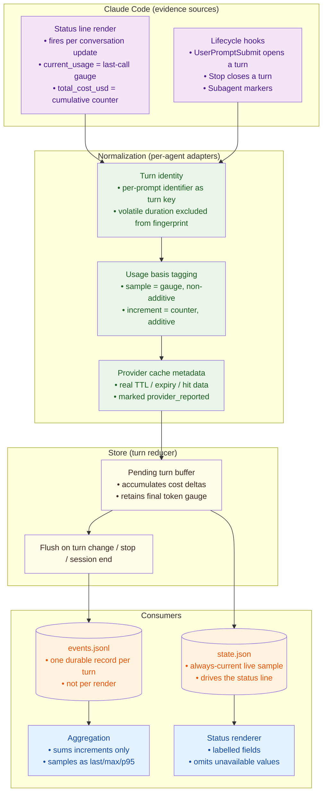

# Feature Intent: Trustworthy Claude Code Telemetry

## Problem Statement

Tokenwatch records a telemetry event every time Claude Code re-renders its status line — roughly every conversation update, not once per turn — so a single turn is stored 20-30 times over. Because the aggregation layer then sums those repeated samples as if each were an independent turn, every token total, cache ratio, distribution, and model breakdown that `tokenwatch analyze` reports for Claude is inflated by the render-to-turn ratio. Compounding this, the fields that would let the system tell renders apart from turns are either unread (Claude's per-prompt identifier), fabricated (cache TTL), or actively poisoning deduplication (a wall-clock duration field inside the event fingerprint).

## Intent

Make every number Tokenwatch displays or reports for Claude Code defensible against the provider's own figures, by modelling gauge-style samples and counter-style increments as distinct kinds of evidence rather than summing both.

## Value Proposition

**For users:**

- Token and cost figures that match what Claude Code itself reports, instead of being inflated by an unpredictable multiple
- A status line whose every field is self-describing, so no one has to guess which number is cost, context, cache, or output
- Honest absence: a value the provider does not supply is shown as unavailable rather than silently replaced by a local default
- Per-turn cost that actually reflects a turn, so switching models or escalating effort produces a visible, trustworthy change

**For business:**

- Cost-reduction decisions rest on measurements that survive scrutiny, which is the entire premise of the tool
- An audit skill that cannot be accused of inventing numbers, protecting the project's core privacy-and-evidence positioning
- A durable event ledger small enough to retain for months rather than one that grows by tens of megabytes per active day

## High-Level Approach

Introduce an explicit additivity dimension on every usage record so the pipeline knows whether a measurement may be summed. Claude's status payload is a **sample** (a gauge describing the most recent API call, where `input_total` tracks context size), whereas provider cost is a **counter** whose successive differences are genuinely additive. The store then collapses the repeated samples belonging to one turn into a single durable record keyed by Claude's own per-prompt identifier, accumulating cost deltas across that turn while keeping only the final token gauge. Aggregation and the status renderer consume this distinction directly: increments are summed, samples are reported as last/max/percentile, and any provider-supplied cache metadata replaces the locally guessed default.

**Key Components:**

- Turn identity resolution: read Claude's per-prompt identifier so renders of one turn share a key, and stop mixing a volatile wall-clock duration into the event fingerprint
- Usage basis tagging: mark each usage record `sample` (non-additive gauge) or `increment` (additive counter) at normalization time
- Turn-collapsing store: fold repeated samples for one turn into a single ledger record, summing cost deltas and retaining the last token gauge, flushed on turn change, stop, or session end
- Provider cache metadata: consume Claude's reported cache TTL/expiry/hit data instead of stamping the configured default, and mark the source honestly
- Aggregation split: sum only increments; report samples as distributions, never as totals
- Status renderer: labelled, unambiguous fields with a readable model name and no fabricated values
- Pricing correction: never charge a synthesized cache-write total alongside the split components it was derived from
- Scope correctness: project-scoped installs write machine-specific paths to the developer-local settings file, not the team-shared one

## Architecture Overview

## Success Metrics

- Durable records written per Claude turn converges to one, measured against the count of turn-opening hook events over the same period (observed baseline: roughly 23 stored records per turn)
- Reported session token totals stay within a small margin of the provider's own last-call figures instead of scaling with session wall-clock time
- Per-turn cost shown on the status line equals the provider's cumulative-cost movement across that turn, and is non-zero whenever the turn incurred charges (observed baseline: frequently reported as zero because consecutive renders carry an unchanged cumulative value)
- Every cache field displayed is either provider-sourced or explicitly absent; no field derives from the configured default while presenting as a measurement
- A reader unfamiliar with the tool can correctly identify what each status-line number represents without consulting documentation
- Estimated cost for an event carrying split cache-write components equals the sum of those components priced once

## Open Questions

- Does Claude Code expose a per-prompt identifier on both status-line and hook payloads across the versions this project supports, and does it remain stable for the whole turn rather than changing mid-turn?
- Which cache fields does the provider actually populate in practice, and how should the renderer behave when TTL is present but expiry is not?
- When a session ends without a closing hook, should the final pending turn be flushed on a staleness timer, accepted as lost from the durable ledger, or written as an explicitly partial record?
- Subagent activity currently arrives with no model, tokens, or cost attached, so subagent spend is invisible except inside the parent session's cumulative total; is per-subagent attribution obtainable from any available signal, or should the tool state plainly that it is not?
- Should historical records already written under the inflated model be migrated, quarantined behind a schema version, or left for the operator to prune?

## Out of Scope

- Reconstructing accurate history from telemetry already captured under the render-per-event model
- Per-subagent cost attribution, until a signal carrying subagent model and token usage is confirmed to exist
- Any change to the Codex or Copilot adapters beyond what the shared usage-basis tagging requires
- Bundling model prices, or estimating cost when the provider reports it directly
- Replacing the JSONL store with a database, or introducing a background daemon to serialize writes
- Capturing raw provider payloads for field-drift debugging, which would breach the project's metadata-only guarantee
